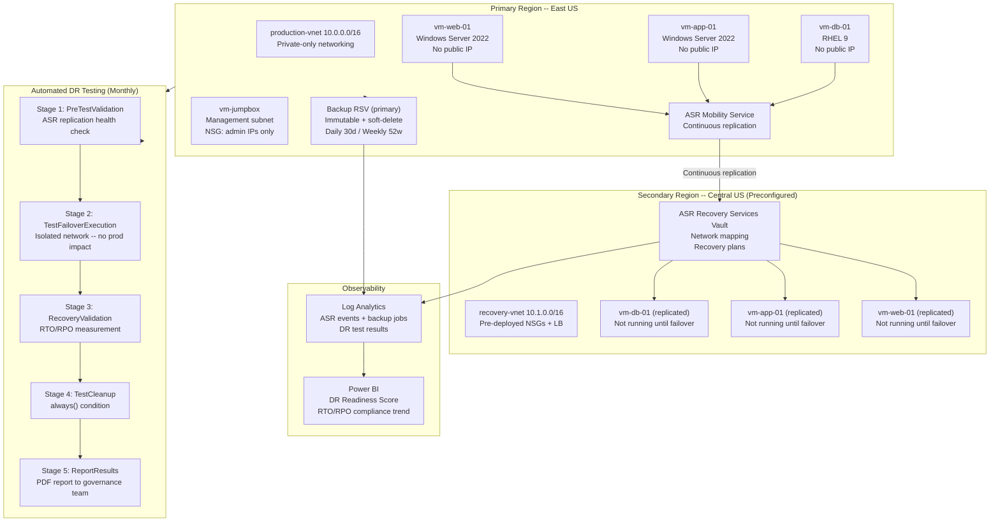

# Cloud-Native Disaster Recovery & Business Continuity Platform

> **Design Study** -- Independent architecture exercise for enterprise Azure environments. Not associated with a production deployment.

Cloud-native BCDR platform -- Azure Site Recovery multi-region active-passive replication (East US to Central US), automated recovery plan orchestration with 4-group sequencing, immutable Azure Backup vaults, monthly automated DR test pipelines with isolated failover validation, RTO/RPO compliance measurement, and Power BI DR readiness dashboards. Aligned to ISO 22301, NIST SP 800-34, and PCI DSS v4.0.

Related: [Immutable Backup and Ransomware Recovery](https://sergeksfumey.com/projects/immutable-backup) and [Hybrid Backup for Compliance Retention](https://sergeksfumey.com/projects/hybrid-backup-compliance) cover backup architecture in depth.

---

## Architecture Diagram

---

## Recovery Objectives

| Workload Tier | Target RTO | Target RPO | Replication | Test Frequency |
|---|---|---|---|---|
| Tier 1 -- Mission Critical | 2 hours | 15 minutes | ASR continuous | Monthly |
| Tier 2 -- Business Important | 4 hours | 1 hour | ASR continuous | Quarterly |
| Tier 3 -- Standard Operations | 8 hours | 4 hours | ASR + Backup | Bi-annually |
| Database Tier | 1 hour | 5 minutes | ASR + SQL geo-replication | Monthly |

---

## ASR Replication Policy Configuration

| Parameter | Tier 1 | Tier 2 | Tier 3 |
|---|---|---|---|
| RPO threshold alert | 15 minutes | 1 hour | 4 hours |
| App-consistent snapshot | Every 1 hour | Every 4 hours | Every 6 hours |
| Crash-consistent snapshot | Every 5 minutes | Every 5 minutes | Every 5 minutes |
| Recovery point retention | 72 hours | 24 hours | 15 days |

---

## Recovery Plan -- 4-Group Orchestration

Recovery Plan: order-processing-recovery
Group 1 (execute first):

Script: validate-recovery-network-connectivity
Script: start-recovery-database-services

Group 2 (after Group 1):

Failover: vm-db-01 (database tier)
Wait: 5 minutes (database startup validation)

Group 3 (after Group 2):

Failover: vm-app-01 (application tier)
Wait: 3 minutes (application startup validation)

Group 4 (after Group 3):

Failover: vm-web-01 (web tier)
Script: validate-application-health-endpoint
Script: update-dns-records-to-recovery-region
Script: notify-operations-team-failover-complete

---

## ASR vs Azure Backup -- Complementary Functions

| Capability | Azure Site Recovery | Azure Backup |
|---|---|---|
| Primary purpose | Availability -- fast RTO | Data protection -- RPO and compliance |
| Recovery granularity | Full VM failover | File, folder, VM, SQL point-in-time |
| Retention window | 72 hours (configurable) | Years -- compliance retention |
| Ransomware protection | None -- replicates encryption | Immutable vault -- tamper-proof |
| Use case | Regional outage recovery | Data corruption, ransomware, compliance |

CRITICAL: ASR faithfully replicates ransomware encryption to the secondary region.
Ransomware recovery requires Azure Backup restore from pre-infection point -- NOT ASR failover.

---

## DR Test Pipeline -- Monthly Automated Execution

Schedule: cron 0 2 1 * * (2 AM on 1st of each month)

Stages:
1. PreTestValidation -- ASR replication health check, fail if any VM not in Normal state
2. TestFailoverExecution -- isolated test-failover-vnet, no production connectivity
3. RecoveryValidation -- application health check, actual RTO measurement, RPO validation
4. TestCleanup -- always() condition, runs even on validation failure
5. ReportResults -- PDF report distributed to governance team

DR Test Result Targets:
- Actual RTO achieved: <= 2 hours
- Actual RPO at recovery: <= 15 minutes
- Application health: 100% endpoints responding
- Test failover completion: <= 30 minutes

---

## DR Readiness Score

DR Readiness Score =
(Replication 30% x % VMs in Normal state) +
(RTO 25% x % tests achieving RTO target) +
(RPO 25% x % tests achieving RPO target) +
(Backup 20% x % workloads with compliant backup)

---

## Executive Summary

Architected a cloud-native BCDR platform integrating ASR multi-region replication, automated failover orchestration, continuous DR testing pipelines, immutable backup protection, and centralised RTO/RPO compliance dashboards.

Primary differentiator: continuous DR validation -- automated test failover pipelines executing monthly against isolated recovery environments, measuring actual RTO/RPO rather than assuming readiness from replication health metrics alone.

---

## Architecture Principles

- Recovery readiness by design: continuously validated, not assumed from replication health
- Automated failover orchestration: recovery plans execute through automation, not manual runbooks
- Separation of ASR and Backup: ASR for RTO (availability), Backup for RPO (data integrity, compliance)
- Immutable data protection: vault immutability prevents ransomware-driven backup deletion
- Continuous DR validation: monthly automated test detecting procedure drift before incidents
- Preconfigured secondary region: no cold-start provisioning during actual incidents
- Centralised RTO/RPO observability: unified compliance dashboards for governance and audit

---

## Design Decisions

### ADR-001 -- Active-Passive over Active-Active
**Decision:** Active-passive multi-region DR (secondary compute not running until failover)
**Rationale:** Active-active provides zero RTO but doubles infrastructure cost. Active-passive provides 2-hour RTO at significantly lower cost -- appropriate for most enterprise workloads.
**Trade-off:** 2-hour RTO window. Mitigated by preconfigured secondary infrastructure and automated recovery plans.

### ADR-002 -- Separation of ASR and Azure Backup
**Decision:** Both ASR and Azure Backup deployed for complementary protection
**Rationale:** ASR addresses regional outage (RTO). Azure Backup addresses data integrity, ransomware, and compliance retention -- scenarios ASR cannot handle since it replicates all writes including malicious ones.
**Trade-off:** Two backup systems to operate. Justified by distinct failure scenario coverage.

### ADR-003 -- Automated Monthly DR Testing
**Decision:** Azure DevOps pipeline scheduled monthly test failover execution
**Rationale:** Annual manual tests are too infrequent. A procedure working in January may fail in October due to infrastructure or application changes. Monthly automated tests detect drift continuously.
**Trade-off:** Monthly pipeline execution overhead. Minimal vs cost of failed actual recovery.

### ADR-004 -- Preconfigured Secondary Region Infrastructure
**Decision:** All secondary network infrastructure deployed via Terraform before incidents
**Rationale:** Cold-start Terraform deployment adds 15-30 minutes to RTO before ASR failover can begin. Preconfigured NSGs, VNets, and load balancers mean failover starts immediately.
**Trade-off:** Ongoing secondary region infrastructure cost even when idle. Justified for Tier 1 RTO targets.

### ADR-005 -- Immutable Vault for Production Backup
**Decision:** Recovery Services Vault with compliance-mode immutability
**Rationale:** Standard vaults allow backup deletion by administrators -- a ransomware actor with Azure access can delete backups before triggering encryption. Immutable vault prevents modification regardless of privilege.
**Trade-off:** Cannot shorten retention periods after immutability lock. Acceptable given tamper-proof protection provided.

### ADR-006 -- Azure-Native over Third-Party DR Platforms
**Decision:** Azure Site Recovery and Azure Backup (native) over third-party DR platforms
**Rationale:** Native integration with Azure VMs, networking, Policy, and Monitor reduces operational complexity. No additional licensing or tooling overhead.
**Trade-off:** Vendor lock-in to Azure DR capabilities. Acceptable given full Azure workload estate.

---

## Technologies

| Category | Technologies |
|---|---|
| Disaster Recovery | Azure Site Recovery (ASR) |
| Backup and Retention | Azure Backup + Immutable Recovery Services Vault |
| DR Testing | Azure DevOps YAML Pipelines + Python validation scripts |
| Infrastructure as Code | Terraform |
| Cloud Platform | Azure VMs (Windows Server 2022, RHEL) + VNets + NSGs |
| Administrative Access | Jumpbox VMs (interim -- Bastion planned) |
| Monitoring | Azure Monitor + Log Analytics |
| Reporting | Power BI + Azure Workbooks |
| Governance | Azure Policy + Microsoft Defender for Cloud |
| Compliance Frameworks | ISO 22301 + NIST SP 800-34 + PCI DSS v4.0 |

---

## Repository Structure

cloud-native-bcdr-platform/
├── terraform/
│   ├── modules/
│   │   ├── asr-replication/
│   │   ├── backup-vault/
│   │   └── recovery-network/
│   └── environments/
│       └── prod/
├── pipelines/
│   └── dr-test-pipeline.yml
├── scripts/
│   ├── validate_application_health.py
│   ├── calculate_actual_rto.py
│   ├── validate_rpo_compliance.py
│   └── generate_dr_test_report.py
├── kql/
│   ├── asr-replication-health.kql
│   ├── dr-test-results-trend.kql
│   └── backup-compliance.kql
└── docs/
    ├── architecture.md
    ├── recovery-plan.md
    └── dr-test-runbook.md

---

## Future Evolution

- Active-active for Tier 0 workloads where 2-hour RTO is not acceptable
- Azure Chaos Studio for automated resilience testing beyond regional outage scenarios
- AI-assisted failover optimisation predicting replication degradation before RPO breach
- Cyber recovery vault with airgapped isolation for simultaneous primary/secondary compromise
- Cross-cloud BCDR federation for AWS/GCP workloads

---

*Part of the [sergeksfumey](https://github.com/sergeksfumey) infrastructure architecture portfolio · [sergeksfumey.com](https://sergeksfumey.com)*
